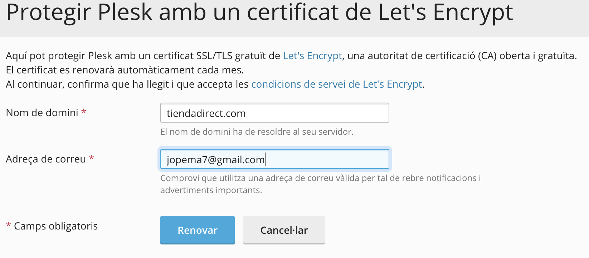

# Evidalia

## Configuración VPS

Suscripción: initias.com

Dominios:

- initias.com (evidalia)
- tiendadirect.com (evidalia)
- test.initias.com
- hortdendidac.com
- test.hortdendidac.com
- frutayverduraonline.es

### initias.com

Carpeta: httpdocs/initias/

### frutayverduraonline.es

Carpeta: httpdocs/frutayverduraonline.es/public

## Pasos
- [ ] Primero probamos un sitio estatico en tiendadirect.com

- [ ] Luego probamos un sitio php con composer en tiendadirect.com

- [ ] Finalmente probamos la web del hort en tiendadirect.com

- Contratar server
- Nos dan la siguiente información:
  - Hostname: vps-ev503756.servidor.hosting
  - IP Primaria: 31.24.159.219
  - Nameservers: 84.246.209.4 - 84.246.210.4

# Configuración de servidor con plesk para PHP

### Acceder por primera vez

En el navegador, accedemos a `https://[IPServidor]:8443`.

Iniciamos sesión con usuario `root` y la contraseña que nos han dado al crear el servidor.


### Configurar usuario admin

Configuramos un correo y una contraseña para el usuario admin.

[Y la licencia plesk.](https://help.clouding.io/hc/es/articles/360011095840)


### Seleccionar configuración inicial con PHP

Seleccionamos *PHP -> Crear una aplicación de muestra*.


### Configurar hostname en el servidor

Desde el asistente podemos indicar el dominio principal del servidor.


Debemos ir a *Herramientas y Configuración > Configuración General > Configuración del servidor y aquí modificar el parámetro Nombre de host completo*

Tambien debemos configurar las dns en nuestro proveedor de dominio.

```
ns1.clouding.io (93.189.92.200)
ns2.clouding.io (93.189.93.200)
```


Para consultar los nameservers de los dominios: [intoDNS](https://intodns.com/)

[DNS en evidalia](https://blog.evidaliahost.com/3-pasos-crear-los-name-server-de-tu-servidor-vps/)

### Registros para web

Para que un dominio cargue una web, ya sea Apache o Nginx, tenemos que crear los siguientes registros.


### Certificados 

Para proteger plesk:

Eines i configuració -> seguretat -> certificats ssl/tls

+ Let's encrypt



Para proteger cada dominio:

En el dominio, certificado SSL/TLS, y Instal·lar un certificat bàsic gratuït de Let's Encrypt


Protegir el domini i el subdomini www.

### Publicar sitio con git

En sitios web -> dominios -> dominio -> Repositorio Git -> Añadir repositorio git, pegar la ruta del repo.


Crear nueva clave ssh en github y pegar la clave pública generada en el paso anterior.

Se despliega el sitio automáticamente.

Ir al dominio -> Hosting y DNS -> Configuración del hosting y asegurarse que la raiz del documento apunta al index.php

### Configurar el webhook

En repository settings copiar el enlace webhook.

En github, repo -> settings -> webhooks y darlo de alta pegando la url.

### Composer

Para que el pluguin Composer de plesk funcione hay que modificar el php.ini activando allow_url_fopen=On.

Para hacerlo ir a Herramientas y configuración -> Configuración general -> Configuración de PHP, seleccionar el PHP que estemos usando, ir a la pestaña php.ini.

En configuración del repositorio -> acciones adicionales de despliegue:

```/opt/plesk/php/7.4/bin/php /usr/lib/plesk-9.0/composer.phar install &> composer_last_log.txt```

En dominio -> hosting y dns -> Acceso a hosting web, poner *Acceder al servidor vía SSH* en `/bin/bash`.

### Actualizar el sistema

Herramientas y configuración -> Administración del servidor -> Actualizaciones del sistema -> Todos los paquetes

### MySQL

[Acceso remoto](https://support.plesk.com/hc/en-us/articles/213904365-How-to-enable-remote-access-to-MySQL-server-in-Plesk-)

### Permitir FollowSymLinks de Apache

[FollowSymLinks](https://support.plesk.com/hc/en-us/articles/115001125289-A-website-hosted-in-Plesk-shows-500-Internal-Server-Error-Option-FollowSymLinks-not-allowed-here)

## Fuentes

[Primeros pasos con plesk](https://help.clouding.io/hc/es/articles/360013279620)

[Configurar repo](https://docs.plesk.com/en-US/obsidian/customer-guide/git-support/using-remote-git-hosting.75848/#using-ssh-connection)

[Gestion permisos](https://www.hostinger.es/tutoriales/cambiar-permisos-y-propietarios-linux-linea-de-comandos/)

[Composer en plesk](https://ourcodeworld.com/articles/read/821/how-to-use-composer-with-plesk-use-a-different-version-of-php-to-run-composer)

[Composer fails](https://ma.ttias.be/php-composer-installation-fails-file-could-not-be-downloaded-allow_url_fopen-must-be-enabled/)

